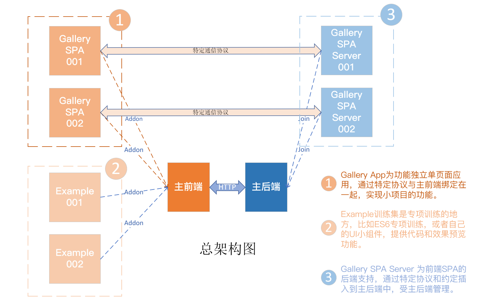
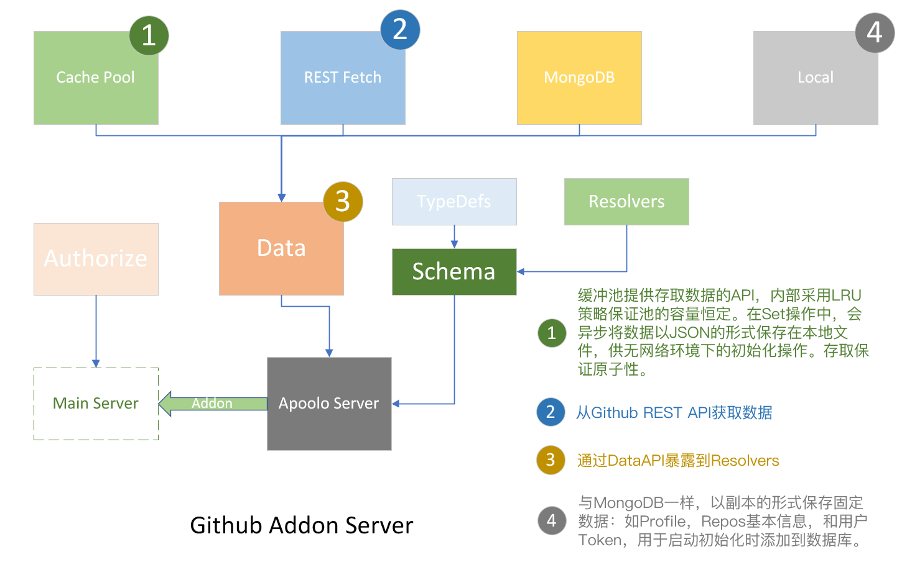

# 学习系列：learns-vue

本项目为全栈Web，设计的灵感来自 Flutter Gallery 项目，提供一个写demo和小项目的平台，旨在广泛地涉猎技术栈。

## 亮点

+ 前端的设计尽可能地接近Flutter Gallery项目，跟随大师的设计对培养CSS基本功很有用，另外，数学能让代码从300行减到100行，并提高维护性。

+ 后端Github addon采用GraphQL作为通信媒介，访问Github REST API获取数据，设计有缓存池，采用LRU策略。目前对GraphQL技术的覆盖率比较低，放心，这是数据库能力。

+ 后端是训练JS基本功的天堂，`@lv/shared` 包含数据处理的工具函数，还有对异步的运用，在数学处理上，我更喜欢数学语言，放心，这些核心函数已经通过单元测试：

  ~~~js
  const result = getRandomNumber('[1:100)') // It's cool!
  ~~~

  ~~~js
  // If you get a big data object, well, nothing could be worse than it!
  // Now you can:
  const filterCode = 'a,b,c.d,.e,.f.g,..h.s,.j.r,.k.l.m,n.o.p,..t,..u.v,.w,x,y'
  const result = filterObject(filterCode,source)
  ~~~

+ 好了，慢慢欣赏，不过整个项目的完成度目前依然非常残缺，除了精妙的考量，你还会碰到简单粗暴的操作，颇有C语言的强势作风，不管咋样。。。路漫漫其修远兮(✿◕‿◕✿)

## 架构图

## 《箴言：专业》

箴言 是我从一个小白，看啥啥不懂，见啥啥焦虑 的状态一路走来的经验和思考：

1. 不管是 土木工程师、机电工程师，还是IT工程师，他们的本质都是为解决问题而生，所以工程师的水平取决于经验，至于学历，决定你解决问题的复杂度和效率。—— 要学会面向问题编程，而不是舍本逐末，搞行为艺术。
2. 当他们说“一定要动手写代码”的时候，其实是告诉你：看代码是自上而下的过程，写代码是自下而上的，后者才是符合人性的。—— 当我一个页面写到400行，上下检查的时候，我也头疼。

3. 用第三方库是好事，但如果你连源码都没看，怎么敢放到你的项目的？—— 我本来想用Vuetify，毕竟可以省省力气了，但是我错了。
4. 如果你想了解微服务，正好你对Nodejs比较了解，那你赶紧弄个Nodejs的框架先把这个领域的思想和需要关注的问题掌握吧！
5. 一个后端，用Nodejs呢，还是Java呢，还是Golang呢，还是 dotNET 呢? 这个取决于你的项目需求，他们都有各自的优势，实战中的筛选基本上毫无悬念，对我们来说，他们本质都是一样的，难道在Java中使用黑红数，在Go中就不需要了吗？
